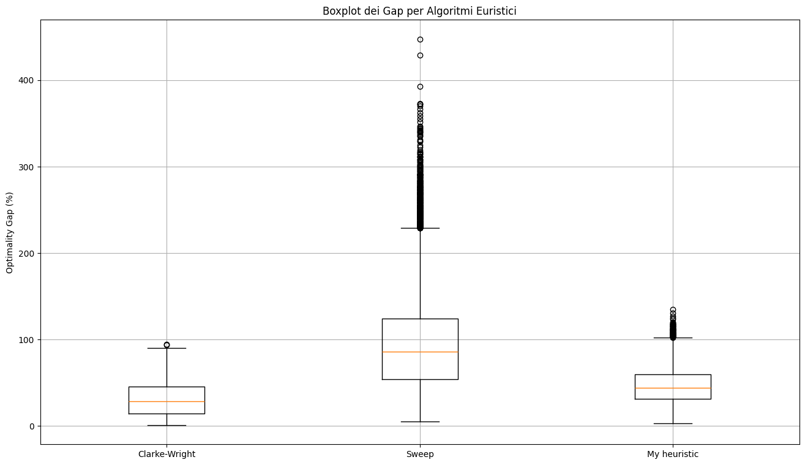

# Comparison between MIP Models and Heuristics for CVRP

This project, created for the "Models and Algorithms for Graph Optimization" course, focuses on solving the **Capacitated Vehicle Routing Problem (CVRP)**, a well-known NP-hard problem in the field of operations research.

The objective is to implement and compare the performance of a Mixed-Integer Linear Programming (MIP) model with several classic and one custom heuristic, evaluating both the solution quality (optimality) and the execution time.

## Implemented Algorithms

The following solution approaches were implemented in the project:

1.  **MIP (Mixed-Integer Programming) Model**: An exact mathematical model formulated in AMPL and solved using the Gurobi solver. This approach guarantees finding the optimal solution but can require very high computation times.
2.  **Clarke and Wright Heuristic (Savings Algorithm)**: One of the most well-known heuristics for the VRP, which starts from an initial solution where each customer is served by a dedicated vehicle and progressively merges routes to reduce total costs.
3.  **Sweep Algorithm**: A two-phase heuristic that first groups customers based on their polar angle with respect to the depot (clustering) and then solves a Traveling Salesperson Problem (TSP) for each cluster.
4.  **Custom Heuristic**: A custom heuristic developed for this project.

## How to Use the Project

### Prerequisites

Ensure you have Python and the following libraries installed:

-   `pandas`
-   `numpy`
-   `matplotlib`
-   `amplpy`

A valid license and a working installation of the **Gurobi** solver and **AMPL** are also required.

### Execution

The scripts in the `/solvers` folder can be run from the command line

## Results Analysis

The tests were performed on two main sets of instances: **Augerat 1995** and **XML100 2021** (https://vrp.atd-lab.inf.puc-rio.br/index.php/en/). The results show the classic trade-off between solution quality and computation time.

-   The **MIP model** finds optimal solutions for small-sized instances, but its execution time grows exponentially with the number of customers.
-   The **heuristics** provide good quality solutions in very short times, making them suitable for large-scale problems.

Below are some of the main charts summarizing the results obtained.

### Optimality Gap vs. Number of Customers (N)
The chart shows how the percentage gap from the optimal (or best-known) solution for the heuristics tends to increase as the number of customers grows.

### Comparative Boxplot of Gaps (XML100 Dataset)
This boxplot compares the distribution of the optimality gap for the different heuristics on the XML100 dataset, highlighting their relative performance.

### Optimality Gap (XML100 Dataset)
This chart shows the average optimality gap for each heuristic on the XML100 dataset, for each type of problem instance.

